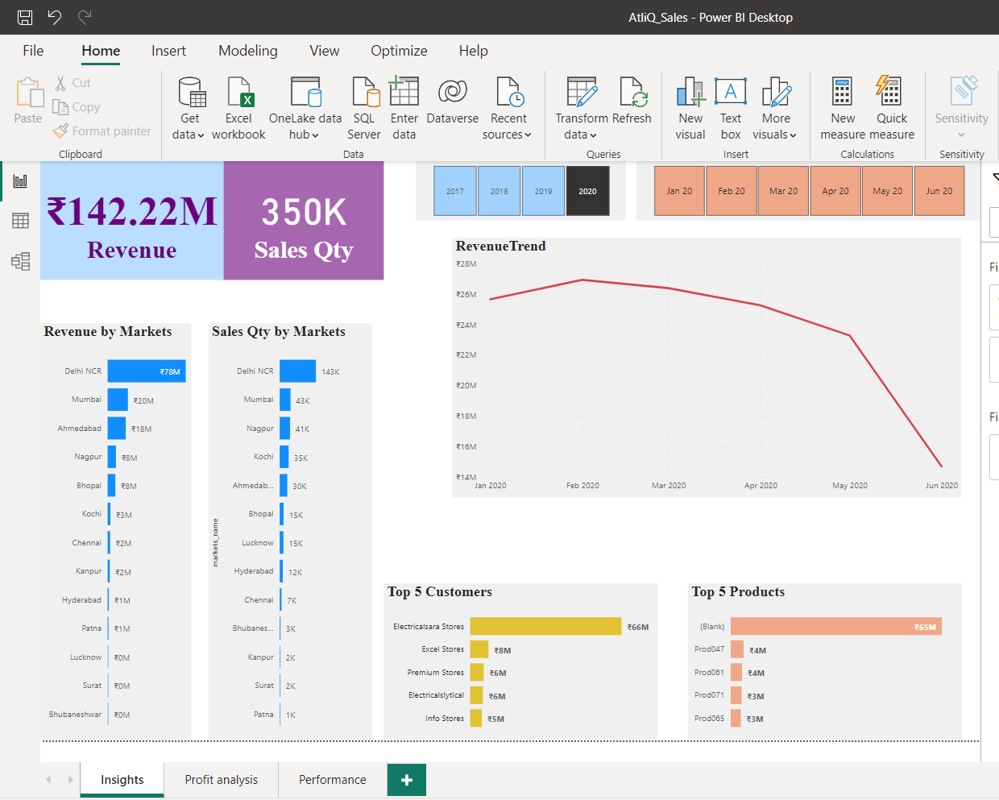
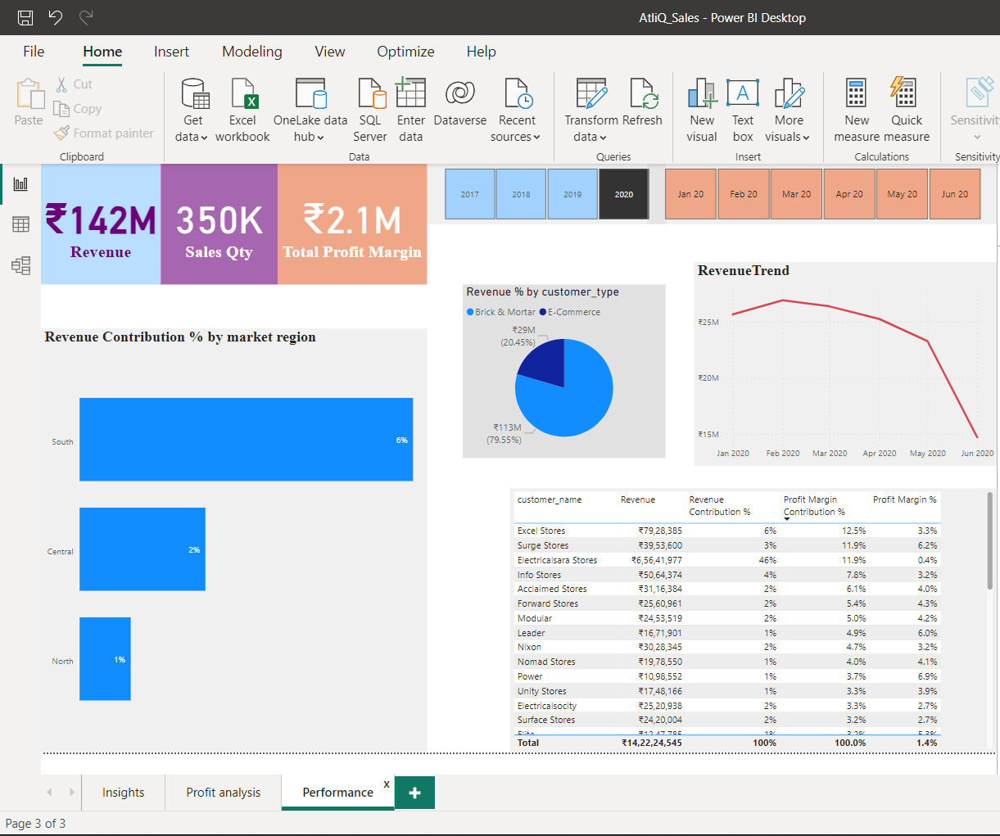

Objective :
  * The aim of this project is to analyze the data for Atliq Hardware to uncover insights that can inform business decisions by identifying trends and patterns in       the data.

Result :  
  * Generated real life sales insights for consumer goods company using SQL and Power BI.
  * The final dashboard was effective at displaying the sales trends of AtliQ Hardware, allowing the users to understand the data and make informed decisions.

Tools:

    powerbi, mysql, daxstudio

Steps :

⚫ Data Import into MYSQL workbench from sql dump file.

⚫ Connected Power BI to MYSQL database.

⚫ Performed ETL on imported data.

⚫ Designed dashboard for finance, sales, marketing, and supply chain department.

Report :
* Finance View
* Marketing View
* Sales View
* Supply Chain View

# 📊 AtliQ Hardware — Sales Insights Dashboard

> A Power BI dashboard built to track KPIs, compare regional performance, and surface actionable sales insights for AtliQ Hardware's leadership team.

---

## 🏢 About the Company

AtliQ Hardware supplies computer hardware and peripherals — desktops, headphones, pen drives, webcams, speakers, mice and more — to clients across India including **Excel Stores**, **Nomad Stores**, **Surge Stores**, and **Electricalsara Stores**. Headquartered in Delhi, the company operates regional offices throughout India.

---

## 🎯 Objective

The sales director needed a real-time, data-driven dashboard to replace manual data gathering from regional managers. The goal was to:

- Track revenue and sales KPIs across markets
- Identify top-performing customers and products
- Reveal profit trends by region
- Enable fast, evidence-based decisions

---

## 🪜 Steps Followed

1. **Data Import** — Loaded all required tables into Power BI via MySQL connection
2. **Data Cleaning & Transformation (ETL)**
   - Removed rows where sales amount was 0 or negative
   - Filtered to India-only markets
   - Normalized currency by creating a conditional column to convert all transactions to INR
3. **Data Modelling** — Built a relational data model connecting transactions, customers, products, markets and date tables
4. **DAX Measures** — Created calculated columns and measures for revenue, profit margin, and contribution %
5. **Dashboard Design** — Built 3 interactive report pages with slicers for year and month

---

## 📈 Dashboard Pages

| Page | Description |
|------|-------------|
| 📌 **Insights** | Revenue KPIs, market-level sales, top 5 customers & products, revenue trend |
| 💰 **Profit Analysis** | Profit % and profit contribution % by market, revenue trends |
| 🏆 **Performance** | Revenue contribution by region, customer-level revenue & profit margin table |

---

## 🔢 Key Metrics (2020)

| Metric | Value |
|--------|-------|
| 💰 Total Revenue | ₹142.22M |
| 📦 Total Sales Quantity | 350K units |
| 📊 Total Profit Margin | ₹2.1M |
| 📉 Overall Profit Margin % | 1.4% |

---

## 🔍 Key Insights

🏙️ Revenue by Market

| Market | Revenue | Sales Qty |
|--------|---------|-----------|
| Delhi NCR | ₹78M | 143K |
| Mumbai | ₹20M | 43K |
| Ahmedabad | ₹18M | 30K |
| Nagpur | ₹8M | 41K |
| Bhopal | ₹8M | 15K |
| Kochi | ₹3M | 35K |
| Chennai | ₹2M | 7K |

> 📍 **Delhi NCR dominates** with ₹78M in revenue and 143K units — more than 3× the next largest market (Mumbai).

💹 Profit Analysis by Market

| Market | Profit % | Profit Contribution % |
|--------|----------|-----------------------|
| Bhubaneshwar | 10.5% | 0.8% |
| Hyderabad | 6.7% | 3.9% |
| Chennai | 6.3% | 7.6% |
| Kochi | 4.7% | 6.2% |
| Mumbai | 2.4% | **23.9%** |
| Delhi NCR | 0.6% | **22.1%** |
| Ahmedabad | 2.2% | **19.0%** |
| Lucknow | -2.7% ⚠️ | -0.6% |

> 📍 **Mumbai and Delhi NCR** together drive ~46% of total profit contribution despite relatively modest profit margins.
> ⚠️ **Lucknow is loss-making** at -2.7% profit margin — a market that needs strategic review.

👥 Top 5 Customers

| Rank | Customer | Revenue |
|------|----------|---------|
| 🥇 | Electricalsara Stores | ₹66M |
| 🥈 | Excel Stores | ₹8M |
| 🥉 | Premium Stores | ₹6M |
| 4 | Electricalsytical | ₹6M |
| 5 | Info Stores | ₹5M |

> 📍 **Electricalsara Stores** alone accounts for ~46% of total revenue and is by far the most critical customer relationship to maintain.

📦 Top 5 Products

| Rank | Product | Revenue |
|------|---------|---------|
| 🥇 | (Blank / unclassified) | ₹65M |
| 🥈 | Prod047 | ₹4M |
| 🥉 | Prod061 | ₹4M |
| 4 | Prod071 | ₹3M |
| 5 | Prod065 | ₹3M |

> 📍 A significant portion of revenue is attributed to unclassified products — improving product data quality is recommended.

🌍 Revenue by Region

| Region | Revenue Contribution |
|--------|---------------------|
| South | 6% |
| Central | 2% |
| North | 1% |

> 📍 Revenue is heavily concentrated in the **South region**, suggesting opportunities to grow presence in Central and North India.

📉 Revenue Trend (Jan–Jun 2020)

Revenue peaked in **January 2020 (₹28M)** and declined sharply to approximately **₹14M by June 2020**, likely reflecting the market disruption from the COVID-19 pandemic.

> 📍 The consistent downward trend across H1 2020 signals a need for recovery strategy and diversified revenue streams.

🏪 Channel Split

| Channel | Revenue | Share |
|---------|---------|-------|
| Brick & Mortar | ₹113M | 79.55% |
| E-Commerce | ₹29M | 20.45% |

> 📍 The business is heavily dependent on **physical retail (80%)** — growing the e-commerce channel could reduce concentration risk.

---

## 🖼️ Dashboard Screenshots

### Page 1 — Insights

### Page 2 — Profit Analysis

### Page 3 — Performance

---

## 🗂️ Project Structure
